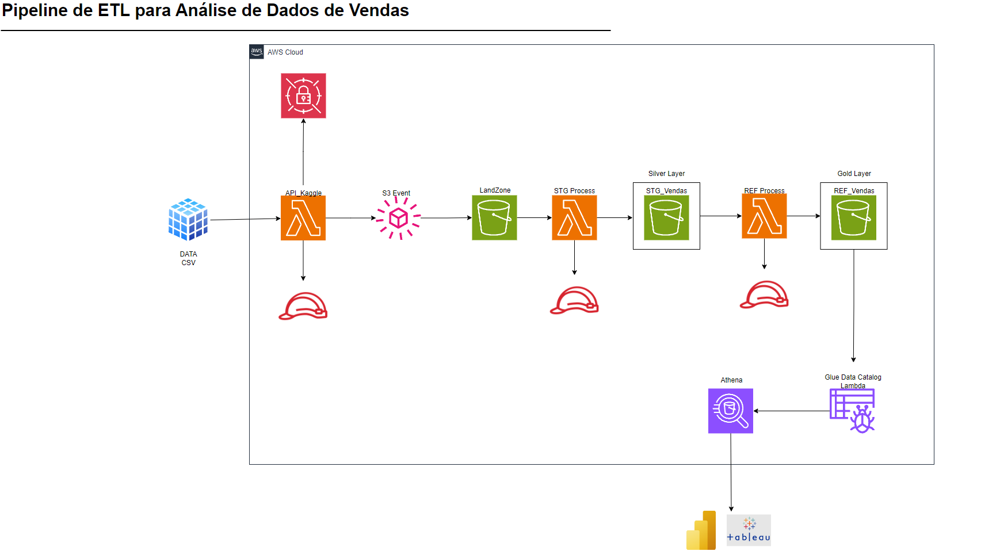
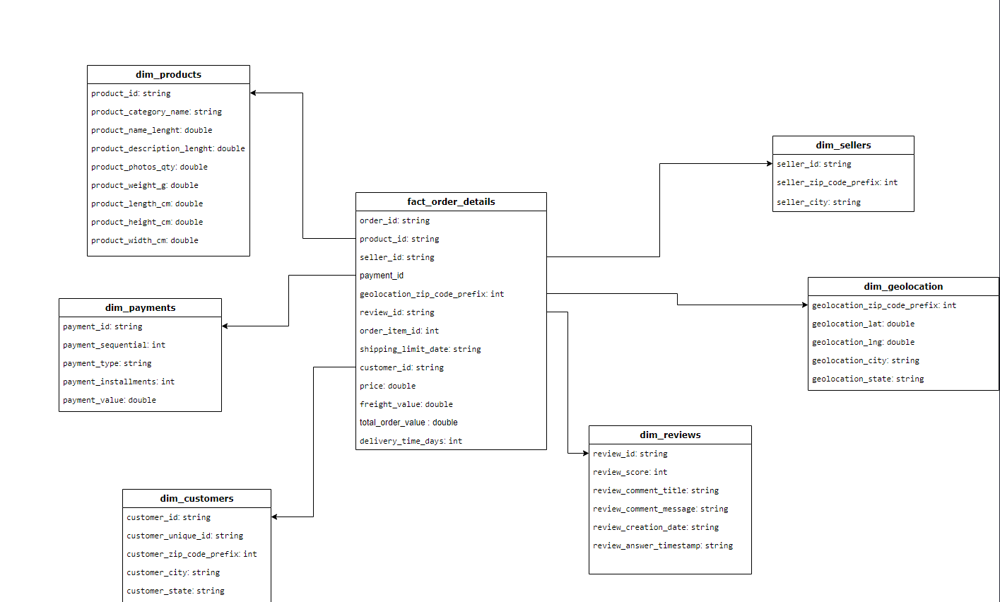

# Pipeline-ETL-Vendas

Este projeto tem como objetivo desenvolver um pipeline de ETL para analisar dados de vendas online.

## Sumário
- [Documentação do Projeto ETL](#documentação-do-projeto-etl)
- [Arquitetura do Projeto](#arquitetura-do-projeto)
- [Camadas do Pipeline de Dados](#camadas-do-pipeline-de-dados)
  - [Camada Landzone (Raw)](#camada-landzone-raw)
  - [Camada Silver (Staging)](#camada-silver-staging)
  - [Camada Gold (Refinamento)](#camada-gold-refinamento)
- [Estratégias de Tratamento e Transformação dos Dados](#estratégias-de-tratamento-e-transformação-dos-dados)
- [Insights Gerados](#insights-gerados)
  - [Produtos e Vendas](#produtos-e-vendas)
  - [Pagamentos e Fraudes](#pagamentos-e-fraudes)
  - [Tempo de Entrega](#tempo-de-entrega)
- [Ferramentas de BI](#ferramentas-de-bi)
- [Conclusão e Recomendações](#conclusão-e-recomendações)

## Documentação do Projeto ETL

Este projeto ETL tem como objetivo analisar dados de vendas online, extraídos do dataset público "Brazilian E-Commerce Public Dataset by Olist" no Kaggle. O objetivo final é permitir a visualização de informações que apoiem na compreensão do desempenho de vendas, identificar possíveis fraudes, analisar a eficiência logística e calcular margens de lucro.

## Arquitetura do Projeto
A arquitetura geral do projeto é mostrada na imagem abaixo:

### Ferramentas Utilizadas:
- **Amazon S3**: Para armazenar os dados nas diferentes camadas de processamento (Landzone, Silver, Gold).
- **AWS Lambda**: Funções serverless para automação dos processos de transformação e refinamento dos dados.
- **AWS Wrangler (boto3)**: Para leitura e escrita de arquivos no S3.
- **Power BI**: Para visualização dos insights gerados após o refinamento dos dados.
- **Python**: Linguagem de programação usada para desenvolver as funções ETL.
  
### Estrutura do S3:
- **Landzone (Raw)**: Armazenamento bruto de arquivos CSV.
- **Stg (Silver)**: Armazenamento dos dados tratados na camada de staging em formato parquet.
- **Ref (Gold)**: Armazenamento dos dados refinados, prontos para análise.

# API do Kaggle com AWS Lambda

## Visão Geral
Esta função Lambda automatiza o download do **Brazilian E-Commerce Public Dataset by Olist** do Kaggle e carrega os arquivos no AWS S3 para facilitar o processamento no pipeline ETL.

## Funcionalidades
- **Download**: Utiliza a API do Kaggle com credenciais para baixar um arquivo ZIP contendo o dataset.
- **Extração e Upload**: Extrai arquivos CSV e faz upload direto para o bucket S3 (`landzone-vendas`).

## Principais Componentes
- **API Kaggle**: Autenticação via variáveis de ambiente (`KAGGLE_USERNAME`, `KAGGLE_KEY`).
- **Extração de Arquivos**: Somente arquivos CSV são extraídos e enviados ao S3.
- **AWS S3**: Armazena os dados para processamento posterior.

## Considerações
- **Autenticação**: Utilizei variáveis de ambiente para credenciais.
- **Permissões**: Papel IAM para manipulação no S3.

Esta função automatiza a etapa inicial do pipeline ETL, garantindo acesso aos dados mais atualizados do Kaggle.

## Camadas do Pipeline de Dados

### Camada Landzone (Raw)
Nesta camada, os dados são carregados diretamente dos arquivos CSV que foram obtidos do Kaggle. Os dados ainda não passam por qualquer tipo de tratamento. O objetivo desta camada é manter uma cópia exata dos dados originais.

### Camada Silver (Staging)
Nesta camada, os dados passam por um pré-processamento para padronizar os valores e preparar os dados para análises posteriores. As principais atividades realizadas são:

- **Tratamento de valores nulos**: Colunas numéricas preenchidas com medianas ou zeros, e colunas categóricas preenchidas com valores padrão como "desconhecido".
- **Normalização de textos**: Conversão de textos para minúsculas e remoção de acentos.
- **Conversão para Parquet**: Os arquivos CSV são convertidos para o formato Parquet para melhorar a eficiência e compressão.

### Camada Gold (Refinamento)
Nesta camada, os dados são refinados para serem utilizados em análises e relatórios. Inclui a criação de tabelas específicas para insights e dashboards. Algumas das transformações realizadas nesta camada incluem:

- **Joins entre tabelas**: Para criar uma visão completa dos pedidos, clientes, produtos, vendedores e transações de pagamento.
- **Criação de colunas derivadas**: 
  - `delivery_time_days`
  - `product_margin`
  - `total_order_value`
- **Divisão dos dados em tabelas menores específicas para análise**:
  - `fraud_analysis_parquet`
  - `payment_analysis_parquet`
  - `product_performance_parquet`
  - etc.

## Estratégias de Tratamento e Transformação dos Dados

### Tratamento Realizado na Silver Layer

- **Preenchimento de Valores Faltantes**:
  - **Numéricos**: Preenchidos com medianas (exceto para colunas relacionadas a pagamento, onde o valor 0 foi utilizado).
  - **Textos**: Preenchidos com "desconhecido".

### Refinamento na Gold Layer

- **Limpeza de Valores Indesejados**: Todos os valores categóricos indefinidos foram excluídos na camada Gold antes de armazenar os dados em Parquet, para evitar problemas em relatórios de BI.
- **Criação de Colunas Derivadas**:
  - Tempo de entrega (`delivery_time_days`): Diferença em dias entre a data de compra e a data de entrega.
  - Margem de lucro (`product_margin`): Calculada a partir do valor de custo e de preço de venda (se disponível).
  
## Insights Gerados

### 1. Produtos e Vendas

- **Volume de vendas (product_sales_volume)**: A quantidade de vendas realizadas para cada produto.
- **Valor total (product_sales_value)**: Valor bruto por produto.
- **Taxa de devolução por produto (product_return_rate)** e a média das avaliações realizadas (average_review_score).

### 2. Análise de Categorias de Produtos

- **Volume de vendas por categoria**.
- **Taxa de conversão por categoria**.

### 3. Pagamentos e Fraudes

- **Análise de Padrões de Pagamento**: Frequência e valor médio (average_payment_value) para cada método de pagamento.
- **Identificação de Fraudes**: Criação de sinalizadores para ordens suspeitas (`is_suspicious_order`), avaliados como 3x o valor médio.

### 4. Tempo de Entrega

- **Tempo Médio de Entrega**: Comparar entre regiões.
- **Taxa de Atrasos nas Entregas**: Percentual de pedidos com entrega além do tempo previsto.

## Integração com Ferramentas de Visualização

Os dados refinados são enviados para qualquer ferramenta de visualização como PowerBI , tableau entre outros.. Para visualizações interativas, usei o ODBC para conseguir pegar meus dados do S3 (ref-vedas e utlizar na ferramentaBI). Cada dataset é analisado separadamente, utilizando as melhores representações para compreensão por ferramentas de visualização:

## Conclusão e Recomendações

Este pipeline oferece um fluxo de trabalho eficiente para o tratamento, transformação e análise de dados de vendas. O uso das ferramentas serverless como AWS Lambda junto com o AWS Wrangler facilitou a implementação e o processamento dos dados, enquanto a integração com o software de visualização permitiu analisar os insights obtidos.
